# CRUD_JSP-BBDD

Gestion de catequesis de Colmenarejo. 
Se requiere realizar la gestión de los niños y catequistas de los tres ciclos de preparación para recibir los sacramentos de iniciación cristiana en el núcleo de Colmenarejo (capilla Virgen de Fátima) que forma parte de la parroquia del Carmen de Campanillas.

# PÁGINA PRINCIPAL
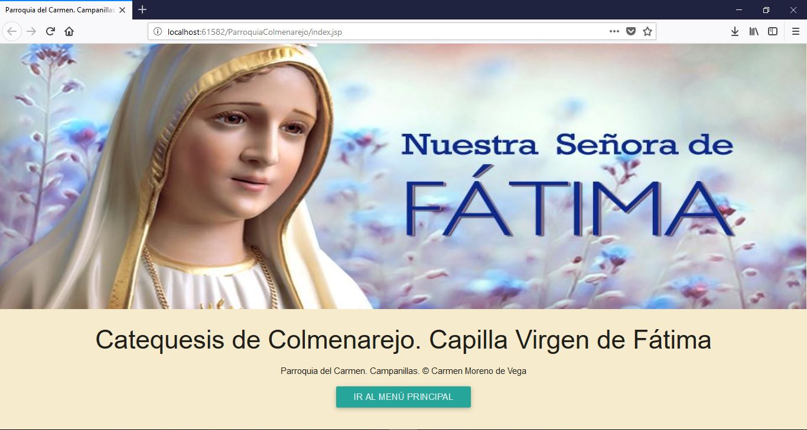

# MENÚ PRINCIPAL
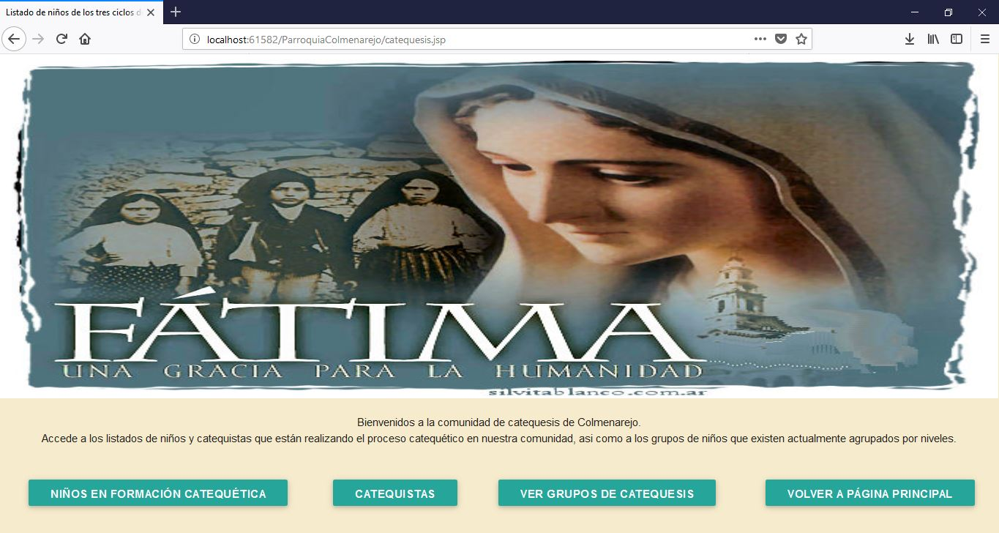

# MENORES EN FORMACIÓN CATEQUÉTICA
 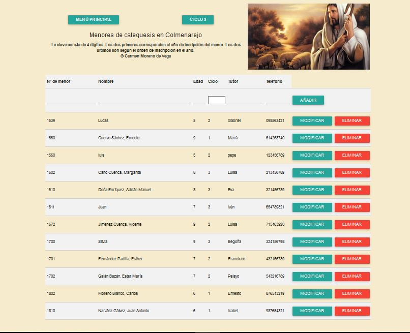

Modficar datos de los menores:
   
   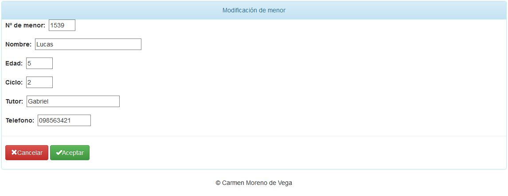

# CATEQUISTAS
 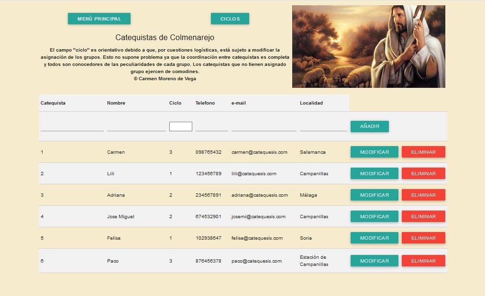

Modficar datos de los catequistas:
   
   

# CICLOS
 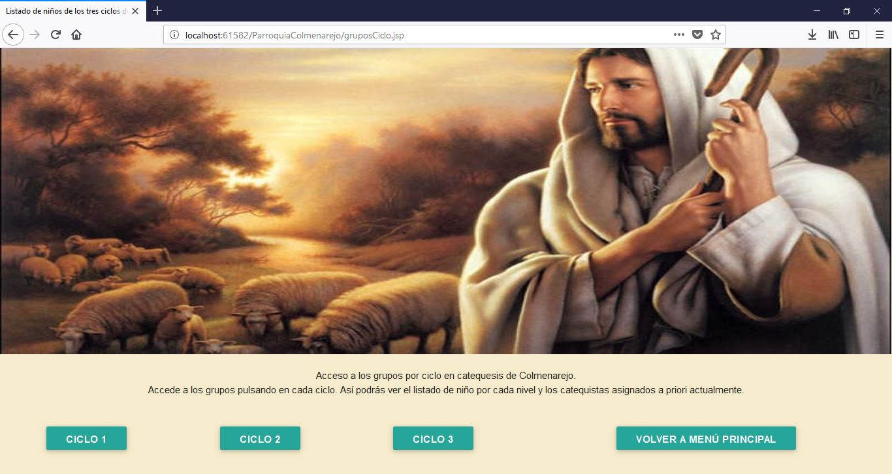
 

# CATEQUISTAS POR CICLO
 

# MENORES POR CICLO
 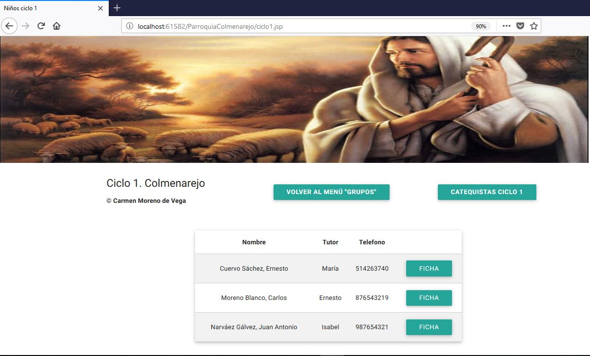

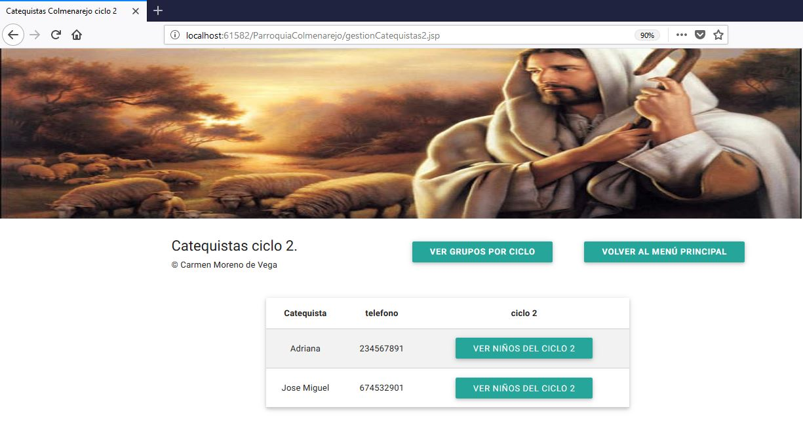

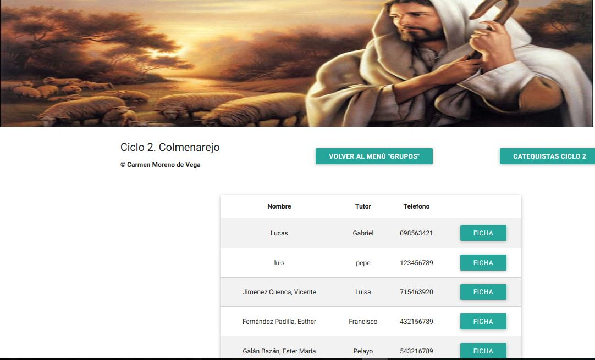

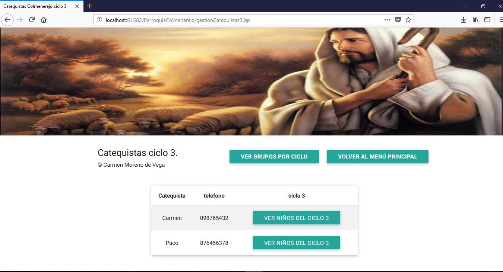
 

 

# BASE DE DATOS

   A continuación, se incluye el diagrama entidad relacion de la base de datos creada para la realizacion de esta
   aplicacion crud:
   
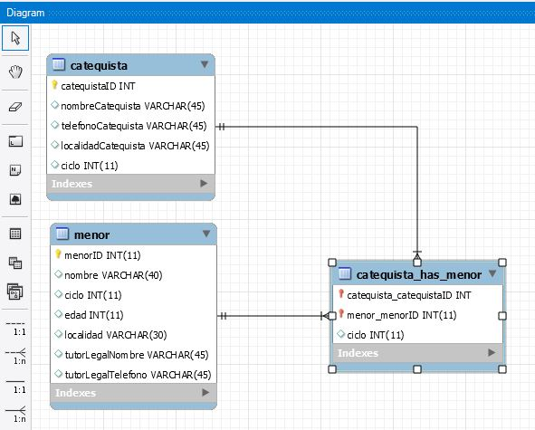
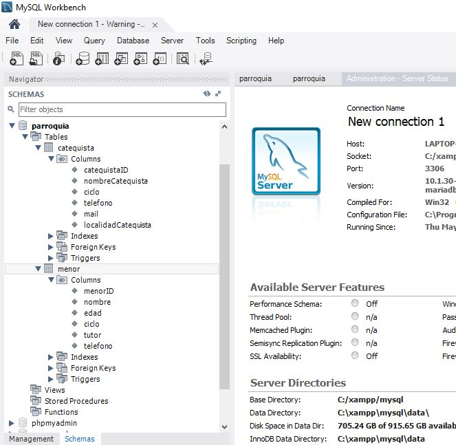
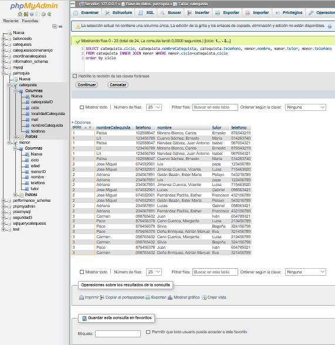
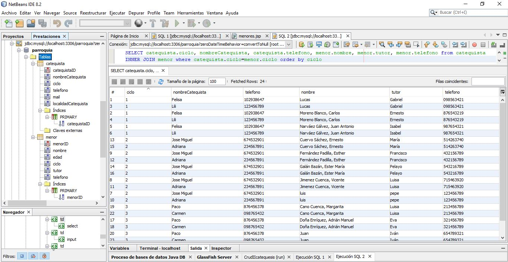

